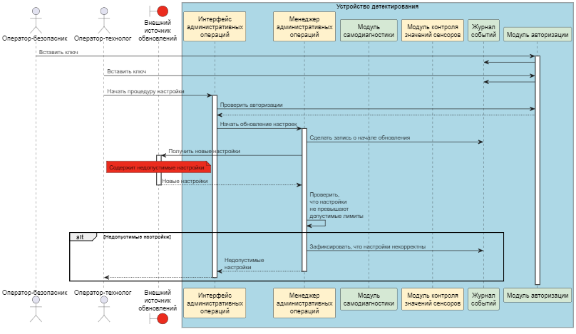
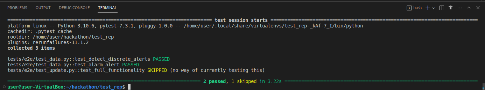

# Отчёт о выполнении задачи "NAME"

- [Отчёт о выполнении задачи "NAME"](#отчёт-о-выполнении-задачи-name)
  - [Постановка задачи](#постановка-задачи)
  - [Известные ограничения и вводные условия](#известные-ограничения-и-вводные-условия)
    - [Цели и Предположения Безопасности (ЦПБ)](#цели-и-предположения-безопасности-цпб)
  - [Архитектура системы](#архитектура-системы)
    - [Компоненты](#компоненты)
    - [Алгоритм работы решения](#алгоритм-работы-решения)
    - [Описание Сценариев (последовательности выполнения операций), при которых ЦБ нарушаются](#описание-сценариев-последовательности-выполнения-операций-при-которых-цб-нарушаются)
    - [Указание "доверенных компонент" на архитектурной диаграмме.](#указание-доверенных-компонент-на-архитектурной-диаграмме)
    - [Политики безопасности](#политики-безопасности)
  - [Запуск приложения и тестов](#запуск-приложения-и-тестов)
    - [Запуск приложения](#запуск-приложения)
    - [Запуск тестов](#запуск-тестов)

## Постановка задачи
Рассматриваемое устройство детектирования (УД) обрабатывает входящие
сигналы от датчиков, в случае превышения порога срабатывания
принимает решение о выдаче команды в систему управления защиты
(СУЗ) реактора (автоматическое срабатывание).
УД передаёт обработанные данные в автоматизированную систему
управления технологическим процессом (АСУ ТП) АЭС для дальнейшей
обработки, на основе этих данных оператор АСУ ТП может принять
решение о выдаче команды в СУЗ (административное срабатывание)
Вторичные функции
- УД сохраняет во встроенном журнале события

## Известные ограничения и вводные условия

### Цели и Предположения Безопасности (ЦПБ)
#### Цели безопасности:
1. Только авторизованный оператор-технолог в присутствии
оператора-безопасника может инициировать изменение настроек УД
2. Только авторизованный оператор-безопасник в присутствии
оператора-технолога может обновлять ПО УД
3. УД выдаёт целостные и достоверные данные во внешние системы

#### Предположения безопасности:

- не рассматриваются атаки, связанные с физическим доступом к
оборудованию (например, подмена входных данных; подключение
имитатора УД и т.п.)
- не рассматриваются риски, связанные с физическим отказом внешнего
оборудования, включая обесточивание УД
- не рассматриваются риски, связанные с физическим отказом
аппаратного обеспечения устройства

#### События безопасности:

1. превышение входным сигналом порога предупреждения
2. превышение входным сигналом порога аварии
3. активация режима обновления системы
4. активация режима изменения настроек
5. изменение порога предупреждения
6. изменение порога аварии

## Архитектура системы

### Внешние компоненты

| Название | Назначение | Комментарий |
|----|----|----|
|*file server* | 	Поскольку в реализации подразумевалось, что инженеры загружают обновление напрямую в устройство, то для эмуляции этого процесса был использован данный компонент. Его стоит рассматривать как подключенное к device устройство, с которого при успешной аутентификации ключей скачивается на device обновление. Поэтому в т.ч. обладает своей памятью в ./data, где и лежит "обновление". | - |
|*protection_system* | Эмулятор системы защиты станции. При выявлении превышающего порог значения в device, сюда отправляется сообщение, чтобы "сработала" защита. | - |
|*scada*  | Эмулятор пульта управления станцией. Получает все данные (значения, сообщения об ошибках и т.д.) от device. | - |
|*sensor* | 	Эмулятор аналогового датчика, который раз в заданное время подает сгенерированный в заданном диапазоне сигнал через HTTP в device. | - |
|*storage* | Фактически это лишь папка с данными, которая является эмулятором некоторой физической памяти устройства device. | - |

### Состав устройства детектирования
| Название на диаграмме | Название в коде | Назначение | Комментарий |
|----|----|----|----|
|Приемник данных с сенсора| *data_input* | Получает данные с датчиков. Передает в модуль контроля значений сенсоров. | - |
|Модуль контроля значений сенсоров| *data_processor* | Получает данные с приемника. Проверяет на предмет превышения пороговых значений (должно быть превышение по двум последним показателям из трех). Также проверяет разброс данных: в случае разброса больше определенной величины формирует соответствующее событие.  | - |
|Модуль отправки данных| *data_output* | Маршрутизирует события во внешние системы (Пульт управления и систему защиты). | - |
| Журнал сообщений | *journal* | Хранит данные о всех события, произошедших в системе. | *не реализовано* |
|-|*monitor* | Монитор безопасности. Содержит политики безопасности. Проверяет все сообщения между сущностями на предмет соответствия политикам. | - |
| Интерфейс административных операций | - | Принимает на вход управляющие сигналы (обновление настроек, обновление прошивки, доступ к журналу) | *не реализовано* |
| Модуль авторизации | - | Модуль, осуществляющий взаимодействие с физическими ключами безопасности. | *не реализовано* |
| Менеджер административных операций | - | Осуществляет управление задачами по обновлению настроек и прошивки, запрашивает события из журналов, также в некоторых сценариях запускает самодиагностику устройства. | *не реализовано* |
| Модуль обновления | - | Осуществляет обновление прошивки устройства. | *не реализовано*  |
| Модуль самодиагностики | - | Осуществляет проверку нормального функционирования устройства. Запускается автоматически с некоторой периодичностью, а также по запросу в некоторых сценариях | *не реализовано*  |
| Внутреннее хранилище | *internal_storage* | Хранилище для бэкапов прошивки и настроек | *не реализовано* |

### Политика безопасности

### Разбор доверенных и недоверенных компонент
Приемник данных с сенсора мы считаем компонентом, повышающим доверие, так как он принимает на вход "сырые" данные с датчиков. На реальной атомной станции в паропроводе устанавливаются комплекты по 3 датчика с двумя дублирующими внутренними контурами каждый. В нашем случае мы будем проводить анализ трех последних измерений (как будто от трех датчиков).

Модуль контроля значений сенсоров повышает доверие, так как он занимается анализом данных и отвечает за автоматический сценарий включения защиты реактора и должен передавать обработанные данные во внешние системы, согласно ЦБ № 1.

Модуль отправки данных также должен быть доверенным, так как он не должен искажать данные, которые передает во внешние системы.
В принципе, можно разбить этот модуль на несколько доменов безопасности, каждый из которых будет отвечать за отправку конкретного типа сообщений конкретной системе. Тогда, если применить криптографические методы защиты информации, каждый из этих поддоменов можно сделать недоверенным.

Модуль авторизации мы считаем повышающим доверенным, так как он проверяет корректность ключей техников. Так как по предположениям безопасности физического доступа к устройству у злоумышленника нет, считаем, что ключи всегда подходят корректно и доступ к ним имеет только квалифицированный персонал.

Интерфейс административных операций считаем повышающим доверие, так как он принимает на вход управляющие сигналы и проверят авторизацию.

Менеджер административных операций считаем повышающим доверие, так как он отвечает за доступ к хранилищу с новой прошивкой и набором настроек. 
Также этот модуль осуществляет проверку прошивки (например цифровой подписи) и корректности новых настроек (согласно ) Именно поэтому сам модуль обновления можно считать недоверенным, так как в случае ошибки обновления настроек или прошивки менеджер восстановит исходные данные.

Модуль самодиагностики должен быть доверенным, потому что только он отвечает за проверку полной работоспособности устройства.

Журнал событий должен быть доверенным, так как он входит в основные ценности системы. \
Журнал можно сделать недоверенным в том случае, если каждое системное событие будет отправляться помимо журнала также в модуль самодиагностики, который будет проверять, что событие в журнале зарегистрировано. Но тогда, он по сути должен повторять функционал журнала, чтобы быть полностью уверенным, что ни одно событие не было записано в искаженном виде.

Внутреннее хранилище должно быть доверенным по той же причине. Оно хранит критичные бэкапы настроек и прошивки для экстренного восстановления в случае сбоев.

Такой большой выбор доверенных компонент может не согласовываться с принципами кибериммунитета, но так как мы имеем дело с устройством с критичными для безопасности функциями, мы не можем допустить сулчаев, когда выход из строя одного или нескольких недо

### Алгоритм работы решения
**Получение данных и анализ расхождения**

**Получение данных и анализ превышения порога**

**Получение событий и удаление событий в журнале**

**Обновление прошивки**

**Обновление настроек**

### Описание Сценариев, при которых ЦБ нарушаются

**Приемник данных начал искажать показания датчиков** \
*Случай покрывается тестом test_detect_discrete_alerts*

Нарушается ЦБ №3

1. Модуль контроля значений проводит анализ на предмет разлета диапазона показаний
2. Модуль контроля значений формирует событие о слишком большом разлете в показаниях
3. Модуль контроля значений направляет событие в АСУ ТП

**Попытка установки неаутентичной прошивки** \
*В тестах не реализовано*

Нарушается ЦБ №3

1. Менеджер административных операций проверяет аутентичность прошивки
2. Менеджер административных операций отклоняет применение прошивки

**Модуль обновления не устанавливает новую прошивку** \
*В тестах не реализовано*

Нарушается ЦБ №3

1. Менеджер административных операций запускает модуль самодиагностики
2. Модуль самодиагностики выявляет нарушение в функционировании системы
3. Менеджер административных операций инициирует восстановление старой прошивки из бэкапа

**Новые настройки устоек нарушают условия эксплуатации** \
*В тестах не реализовано*

Нарушается ЦБ №3

1. Менеджер административных операций проверяет новые значения устоек на предмет допустимых значений
2. Менеджер административных операций отклоняет применение новых значений

## Что можно улучшить
Можно сделать несколько (2-3) контуров "Приемник данных" - "Модуль контроля значений". Анализировать модулем самодиагностики расхождение значений с каждого контура (сохраняя сообщения и id в свое локальное хранилище, например redis) и при обнаружении стабильных расхождений переключаться на дублирующий.

Политика архитектуры в данном случае будет выглядеть следующим образом:

## Запуск приложения и тестов

*Предполагается, что в ходе подготовки рабочего места все системные пакеты были установлены.*

Запуск примера: открыть окно терминала в Visual Studio code, в папке с исходным кодом выполнить

make run или docker-compose up -d

### Запуск приложения

Описание настройки инфраструктуры для разработки можно найти во втором разделе короткого курса на степике https://stepik.org/course/133991/ 

Стандартный способ запуска демо предполагает наличие установленного пакета *docker*, а также *docker-compose*. Для автоматизации типовых операций используется утилита *make*, хотя можно обойтись и без неё, вручную выполняя соответствующие команды из файла Makefile в командной строке.

Другое используемое ПО (в Ubuntu будет установлено автоматически, см. следующий раздел):

- python (желательно версия не ниже 3.8)
- pipenv (для виртуальных окружений python)

Для работы с кодом примера рекомендуется использовать VS Code или PyCharm.

В случае использования VS Code следует установить расширения

- REST client
- Docker
- Python

Запуск примера: открыть окно терминала в Visual Studio code, в папке с исходным кодом выполнить 

**make run**
или **docker-compose up -d**

### Запуск тестов

Примечание: сервисам требуется некоторое время для начала обработки входящих сообщений от kafka, поэтому перед переходом к тестам следует сделать паузу 1-2 минуты

запуск тестов:
**make test**
или **pytest**

Ожидаемый результат: (вывод команды "make test"): 

